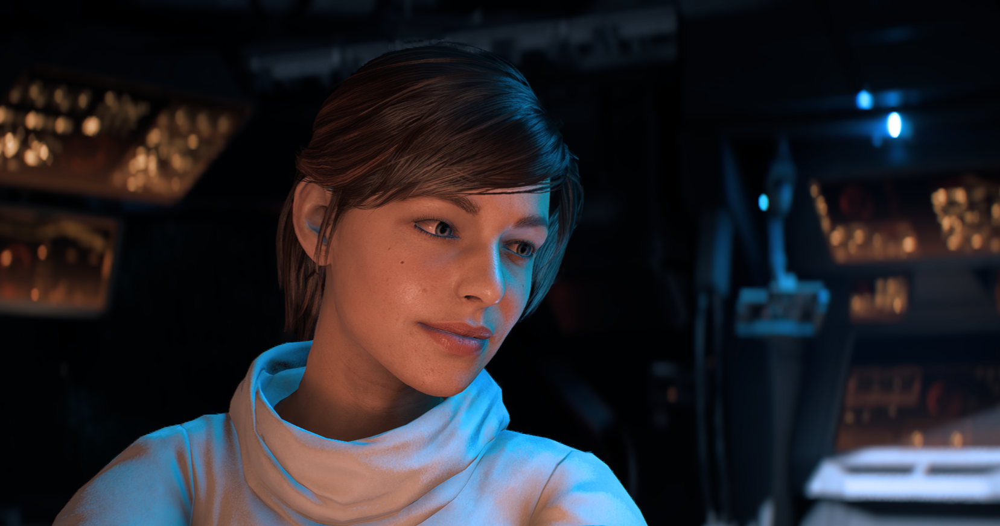



### Alessandra Vasquez

---

*Homeworld*: Tython

*Born*: 1285 ABY

---

*Species*: Human

*Gender*: Female

*Height*: 1,68 m

*Mass*: 

*Hair color*: Brown

*Eye color*: Hazel

---

*Affiliation*: Republic, Jedi Order



# Alessandra Vasquez

She grew up on Tython with her parents and older brother.
When she was three years old, her parent adopted a baby girl at the local orphanage from the city.
They named her Sara and she became her younger sister.

As they grew up together they formed a powerful bond that would later prove really useful.
She didn't know that she was force sensitive as it was not as evident as her sister.
She got along with Sara more than her older brother, she didn't know the difference until she was older.
They would hangout together and watch Sara do some tricks with the force, messing with other kids at school and such.

<!-- Todo

- Sara training her to use the force
- Training other jedis
- Master of the order  -->


