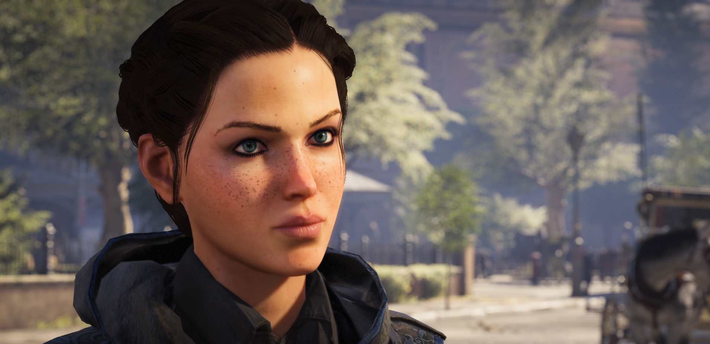



### Sara Vasquez

---

*Homeworld*: Tython

*Born*: 1288 ABY

---

*Species*

*Gender*

*Height*

*Mass*

*Hair color*

*Eye color*

*Hair color*

---

*Affiliation*: Republic, Jedi Order



Sara was given to an orphanage whe she was only weeks old.
No one ever knew who here parents were or where she was born.
It was assumed she was born on Tython since it where she was found.

She grew up with other children until the age of 5 before she was adopted.
Still to this day she doesn't remember the years she spent there.
She was adopted by the Vasquez family on Tython where she had an older sister.
The got along fairly well since she was only a few years older than Sara.
It was pretty common to see children that had some ability with the force, but since the jedi order and the sith were no longer around to train them, their abilities never developed beyond telekinesis capabilities.
Sara displayed some form of force ability when she was playing with the other children at the orphanage.
She was able to make object levitate around her, much more easily and strongly than other children they had seen before.
No one believed she would develop her abilities further.

Whe she attended school she eventually managed to develop bonds with other children that were force sensitive easily, she had no trouble making friends.
Se eventually realized that she could affect minds with the force.
Those that we less strong with the force could be easily influenced and she became able to read their minds.
She tried to be discrete as much about this ability, no one since the jedi went extinct ever came close to her abilities.
At age 10 she became curious as to why she had such strong powers with the force without any training.
She learned that the sith and jedi went extinct hundreds of years ago and since then there has been a balance in the force.
She became worried that she could imbalance the force towards the light or the dark.

As she grew up she started to be more and more connected to the force than she previously thought.
During one of her meditations she was able to feel things and see other places on Tython, at first she was scared, but she eventually realized what it meant.
She meditated further and discovered an imbalance that was growing in the force, there was a darkness that was more and more present.
Sara knew that she had to preserve the balance in the force.
The jedi masters that were one with the force started to manifest themselves in her visions, giving her some insights on the ancient teachings of the light, and how to prevent darkness from taking over.
At the age of 16 she had force powers stronger than anyone had seen in years.
She talked to her parents about the situation that was developing but they didn't believe her.
After asking the master in one of her meditations they agreed to help her convince other that the jedi order needed to return.
Sara went to confront her parents one more time with the help of the masters that manifested themselves as visions.
Together they manage to convince them to rebuild the jedi order.

In a matter of months her parents managed to move around some funds and acquired some land outside the city to rebuild the jedi order.
Sara started teaching her sister NAME in the ways of the force, their bond was so strong that it was easy for her to teach her how to use her force powers.

<!-- Fix the float from the page just in case the content would overflow on the bottom part -->

