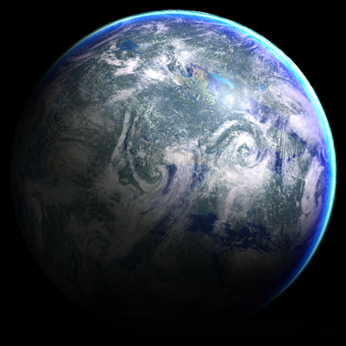





# Tython

Tython was a planet in the Tython system of the Deep Core that played a pivotal role in the histories of the Je'daii Order and its successor, the Jedi Order.
A verdant world that was incredibly rich in the Force, Tython was inhabited by an unknown species hundreds of thousands of years before the rise of the Galactic Empire.

A terrestrial world in the Tython system of the Deep Core, Tython was the fifth planet in orbit around the star Tythos, orbiting Tythos at a distance of less than 160 million kilometers, and the planet was incredibly rich with the Force.
Tython possessed a breathable atmosphere and a temperate climate, and it featured a number of continents separated by oceans and seas.
The planet was geographically varied, as Tython's continents were marked by plains, hills, mountains, and even canyons, and for much of the planet's history, Tython was a particularly verdant world.
Tython was orbited by two moons: Ashla and Bogan, satellites that inspired the Je'daii Order's philosophy of balance between the light and dark sides of the Force, and the Je'daii maintained sentry drones in orbits thirty thousand kilometers above Tython's surface.
Tython's environment was remarkably sensitive to the Force; powerful disturbances in the Force, such the presence of an individual particularly strong in either the light or dark side of the Force, could cause immense Force storms and groundquakes that would ravage Tython's surface.
However, by the year 1990 BBY, all hyperlanes to Tython had become unstable and forgotten, and the planet itself had been devastated—the planet was covered by a constant layer of storms, and its surface was the color of ash, with barren plains where immense forests had once stood.

Tython was home to a large number of species of creatures whose shapes and forms were as varied as the planet's surface, such as screech lizards and acid spiders.
Tython's hook hawks were birds that possessed hooked beaks and sharp talons, and hunted their prey by hypnotizing them with song and then attacking.
Silik lizards were rare but deadly silicon-based creatures that absorbed energy from sand itself.
Six-limbed and the size of a Human adult, silik lizards featured a large number of spikes on their bodies and were known to charge opponents on their hind legs.
The Rift was home to many strange and deadly creatures, many of which were unnamed and unknown. The saarl was a massive, purple-colored worm creature with a tooth-filled maw that opened like a three-petaled flower.
Flame tygahs were eight-limbed reptilian creatures twice the size of a Human that were native to Tython's Strafe Plains; a flame tygah's claws and tail dripped fire and its mouth blazed with heat.
Blood spites were bat-like creatures that fed on warm blood and inhabited the Red Desert, though their existence was widely considered to be only a rumor by the Je'daii.
Ak trees were common in Tython's forests during the time of the Je'daii.

Tython's Moon Channel was home to the tentacled gelfish as well as enormous sea serpents.
The hoofed quadrupeds known as Guids were native to the region around Kaleth, the Je'daii Temple of Knowledge, and while they were not ordinarily aggressive, guids could attack their opponents with their powerful jaws and massive forelegs.
Like the guid, the mammalian uxibeasts were also found in small groups on other worlds despite the fact that they were believed to have originated on Tython.
Uxibeasts were ill-tempered herbivores that traveled in herds and were deceptively aggressive.
The four-legged horranth were reptilian predators that hunted in large family groups and had enormous birth rates—their population was typically only constrained by a limited food supply.
Manka cats, feline predators from Alderaan, eventually found their way to Tython and thrived in the planet's vibrant ecosystem.

## Modern times

Some time before the clone wars and the rise of the empire, the climate on Tython changed and became more hospitable.
The trade routes re-opened and traffic started coming back and people settled on Tython once more.
Due to it's large wildlife, Tython quickly became an touristic attraction to anyone who wants to retreat in the nature.
Even though large cities were built on Tython, large territories of the planet are inhabited, striking a good balance with the environment of the planet.
